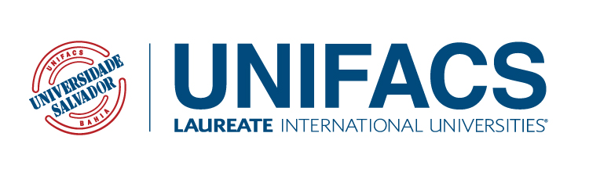
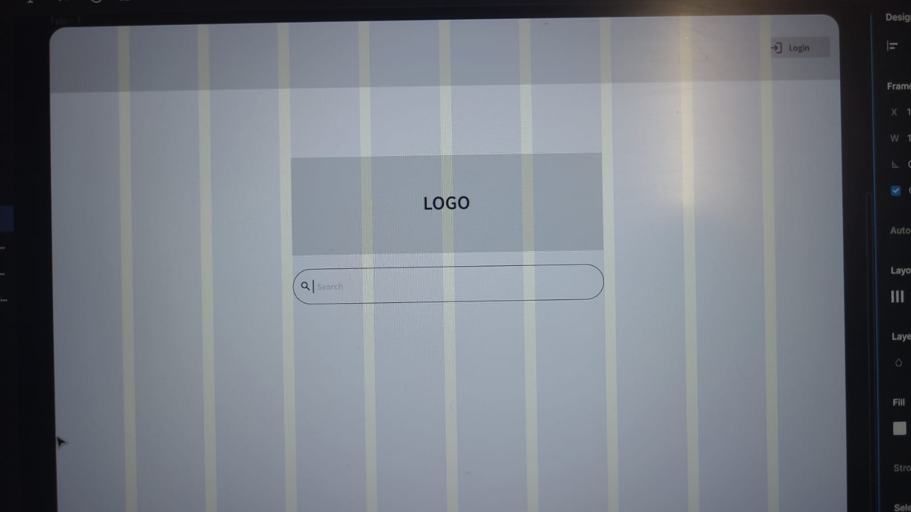
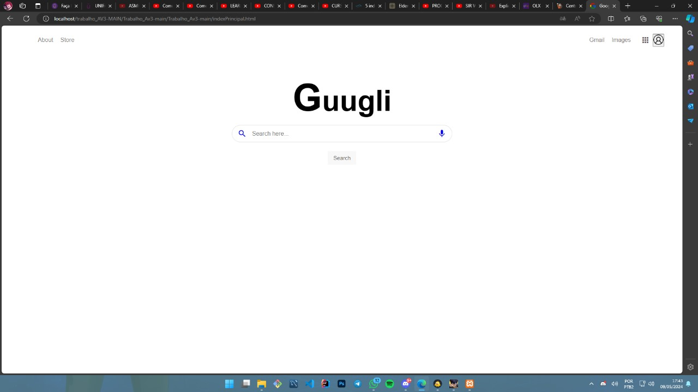
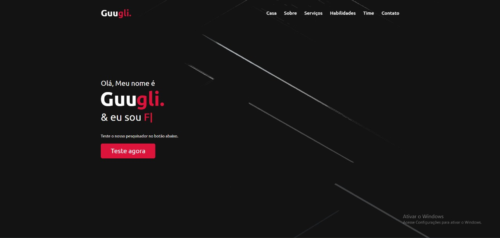
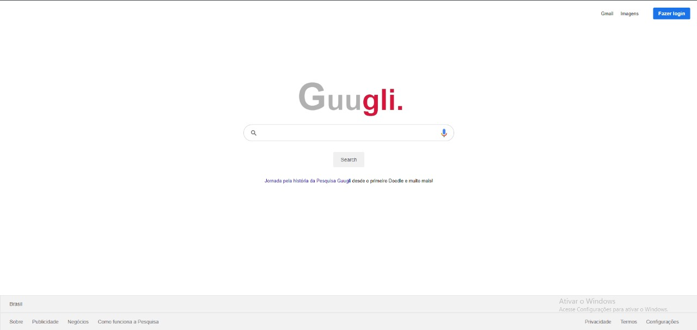
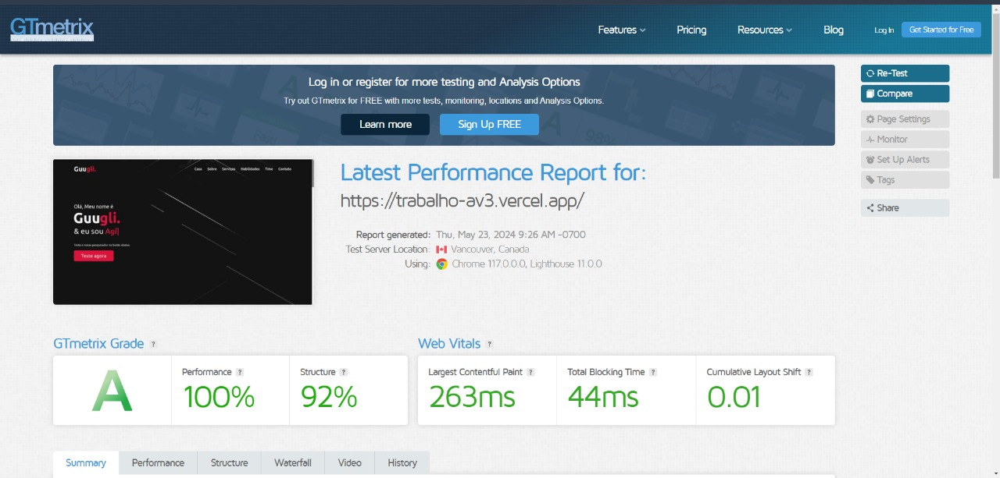
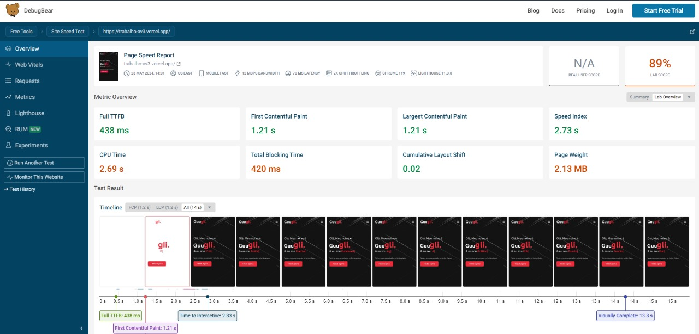
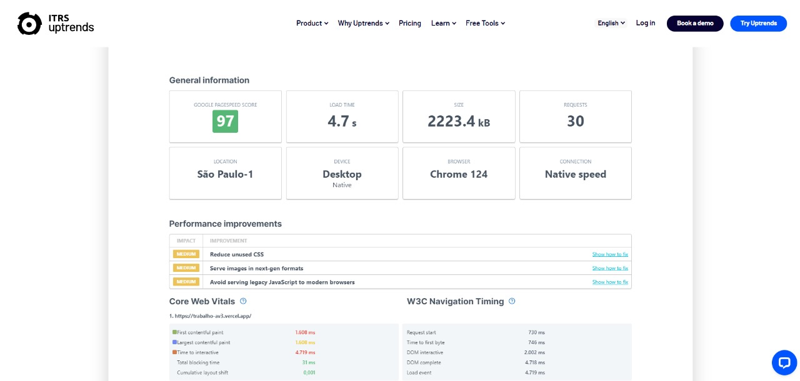
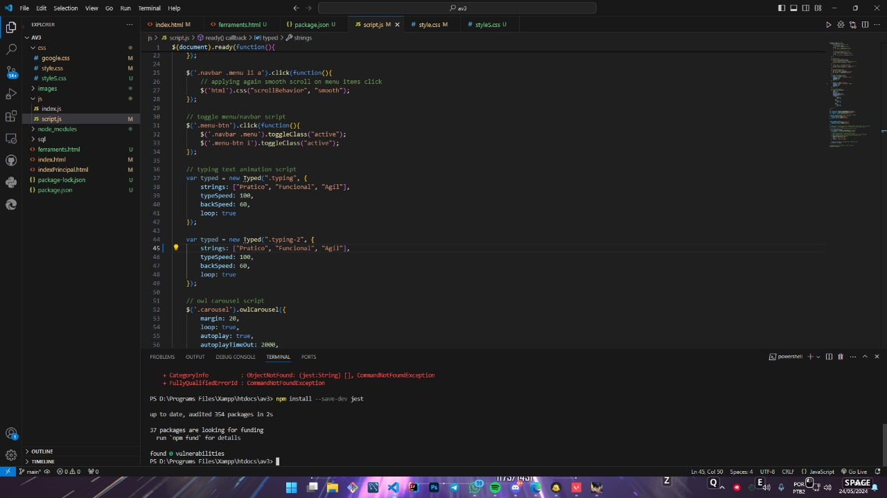
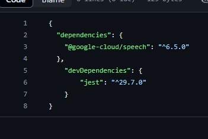

# Documentação AV3

Especificação e Documentação da AV3

### HISTÓRICO DE REVISÕES 

### &#x20;

| **Data**   | **Versão** | **Descrição**                                              | **Autor**      |
| ---------- | ---------- | ---------------------------------------------------------- | -------------- |
| 10/04/2024 | 1.0        | Versão inicial                                             | Jadson Barbosa |
| 15/04/2024 | 1.1        | Ajustes ortográficos e nos requisitos                      | Jadson Barbosa |
| 20/04/2024 | 2.0        | Atualização para atender os requisitos da segunda entrega  | Jadson Barbosa |
| 19/05/2024 | 3.0        | Atualização para atender os requisitos da terceira entrega | Jadson Barbosa |

### &#x20;

### Participantes: 

* Jadson Mendes Barbosa – 12723118224
* Leonardo Calheira Marchesini – 12723130959
* Amanda Márcia Sales da Silva – 12723130588
* Emerson de Aquino Souza Amorim Santos – 12723133775
* Caique Cézar Costa Santos – 12723117486
* Marx Lenin Muniz Vigas – 12723128113
* Eduardo Santos Gomes Ferreira – 12723112499
* Erick De Jesus Santana – 12723130329
* Ian Davi Menezes Alves Bomfim – 12723134435
* Pedro Vinicius Monte dos Reis – 12723110509
* Allan Oliveira Teran Jaime – 12723134433

### **Tabela de Conteúdo**

1\. Escopo Inicial

1.1 Introdução

1.1.1 Finalidade

1.1.2 Escopo

1.2 Requisitos Funcionais

1.2.1 RF001

1.2.2 RF002

1.2.3 RF003

1.2.4 RF004

1.2.5 RF005

1.2.6 RF006

1.2.7 RF007

1.2.8 RF008

1.2.9 RF009

1.2.10 RF010

1.2.11 RF011

1.2.12 RF012

1.2.13 RF013

1.3 Requisitos Não Funcionais

1.3.1 RNF001

1.3.2 RNF002

1.3.3 RNF003

1.3.4 RNF004

1.3.5 RNF005

1.3.6 RNF006

1.3.7 RNF007

1.3.8 RNF008

1.4 Modelo de Processo de Software

1.4.1 Vantagens do Modelo

1.5 Metodologia Ágil

1.5.1 Vantagens da Metodologia

1.6 Ferramenta de Controle de Versão

1.6.1 Vantagens da Ferramenta de Controle de Versão

1.7 Ambiente de Desenvolvimento Integrado (IDE)

1.8 Linguagens de Programação

2\. Modelo de Processo de Software e Metodologia ágil

2.1 Modelo de Processo de Software Utilizado

2.1.1 Fases

2.2 Estrutura da metodologia ágil

2.2.1 Papéis dos participantes

2.2.2 Backlog do produto

2.2.3 Reuniões Scrum

3\. Prototipação e desenvolvimento da Interface

3.1 Protótipo da Interface

3.1.1 Protótipo Inicial

3.1.2 Segundo protótipo

3.2 Versão final da interface

3.3 Código fonte do front-end

4\. Testes de software

4.1 Testes de caixa preta

4.1.1 GTmatrix

4.1.2 DebugBear

4.1.3 Uptrends

4.2 Teste de caixa preta

4.2.1 Jest

**1. Escopo Inicial**

### 1.1 Introdução

Esta documentação fornecerá uma visão geral de toda especificação de requisitos de software, finalidade e escopo do software que será desenvolvido, assim como o modelo de processos de software, metodologia ágil e a ferramenta de controle de versão.

### 1.1.1 Finalidade

A finalidade da especificação de requisitos de software é de descrever totalmente o comportamento da aplicação, descrevendo os requisitos funcionais e não funcionais.

### 1.1.2 Escopo

Essa será uma aplicação com o objetivo de permitir a busca das principais ferramentas de engenharia de software.

### 1.2 Requisitos Funcionais

1.2.1 RF001 - O sistema deve ter 20 ferramentas de engenharia de software.

1.2.2 RF002 - O sistema deve ter uma aba de pesquisa para ferramentas.

1.2.3 RF003 - Cada card de ferramenta redireccionará para o site da ferramenta.

1.2.4 RF004 -

1.2.5 RF005 -

1.2.6 RF006 -

1.2.7 RF007 -

1.2.8 RF008 -

1.2.9 RF009 -

### 1.3 Requisitos não funcionais

1.3.1 RNF001 - O sistema deve ter proteção contra invasões de hackers.

1.3.2 RNF002 - O sistema deve ter uma landing page.

1.3.3 RNF003 - O sistema deve ter os nomes da Staff.

1.3.4 RNF004 - O sistema deve ser responsivo aumentando e diminuindo conforme o necessário.

1.3.5 RNF005 - O site deve ter como cores principais o preto e vermelho.

1.3.6 RNF006 - O sistema deve ser fácil de usar e acessível.

1.3.7 RNF007 - O back-end deverá ser programado em PHP e JS.

1.3.8 RNF008 - O site deve ter um meio de contato com a staff para os usuários.

### 1.4 Modelo de Processo de Software

Será utilizado o Modelo Cascata, este modelo é organizado em ordem sequencial com cinco fases de execução, sendo elas:

* Requisitos;
* Design;
* Implementação;
* Verificação;
* Manutenção.

### 1.4.1 Vantagens do modelo cascata

* Gerenciamento simplificado.
* Otimização de tempo.

### 1.5 Metodologia Ágil

Será utilizado o Scrum, pois é uma metodologia ideal para o cuidado com o trabalho, possuindo o controle de todos os processos.

### 1.5.1 Vantagens da Metodologia

* Planejamento de cada atividade
* Gestão de projetos

### 1.6 Ferramenta de Controle de Versão

Será utilizado o Git, um dos sistemas de controle de versão mais utilizados no mundo.

### 1.6.1 Vantagens da Ferramenta de Controle de Versão

* Desempenho
* Flexibilidade
* Segurança

### 1.7 Ambiente de Desenvolvimento Integrado (IDE)

Será utilizado o Visual Studio Code (VS Code), o editor de código aberto desenvolvido pela Microsoft.

### 1.8 Linguagens de Programação

Serão utilizadas as linguagens PHP e Javascript, com o fito de otimizar o tempo de desenvolvimento.

2\. Modelo de Processo de Software e Metodologia ágil

### 2.1 Modelo de Processo de Software Utilizado 

Modelo de processo de software selecionado para auxiliar no desenvolvimento é o modelo cascata. Foi escolhido pois é o que melhor se encaixava na necessidade desse projeto, devido a sua simplicidade e otimização de tempo.

### 2.1.1 Fases 

* Comunicação
* Planejamento
* Modelagem
* Construção
* Entrega

Detalhamento das fases:

**Comunicação:**

Será realizado as seguintes tarefas:

* Levantamento de requisitos
* Escolha do ciclo de vida
* Escolha da metodologia ágil

**Planejamento:**

Será realizado as seguintes tarefas:

* Definir metas e estimativas

**Modelagem:**

Será realizado as seguintes tarefas:

* Protótipo do do design do site

**Construção:**

Será realizado as seguintes tarefas:

* Elaborar o código do back-end
* Elaborar código do front-end

**Entrega:**

Será realizado as seguintes tarefas:

* Receber o feedback do produto de software

### 2.2 Estrutura da metodologia ágil 

O SCRUM foi a metodologia ágil selecionada.

### 2.2.1 Papéis dos participantes 

| **Documentação do projeto**                    |
| ---------------------------------------------- |
| Jadson Mendes Barbosa / **Gerente de produto** |
| Leonardo Calheira Marchesini                   |

Foram criados três times de desenvolvimento para atender necessidades específicas, uma para o back-end, uma para o front-end e outra para o banco de dados.

| **Time de desenvolvimento - Front-end** |
| --------------------------------------- |
| Allan Oliveira Teran Jaime              |
| Amanda Márcia Sales da Silva            |
| Pedro Vinicius Monte dos Reis           |

| **Time de desenvolvimento - Back-end**           |
| ------------------------------------------------ |
| Eduardo Santos Gomes Ferreira / **Scrum master** |
| Ian Davi Menezes Alves Bomfim                    |
| Caique Cézar Costa Santos                        |

| **Time de desenvolvimento - Banco de dados** |
| -------------------------------------------- |
| Emerson de Aquino Souza Amorim Santos        |
| Marx Lenin Muniz Vigas                       |
| Erick De Jesus Santana                       |

### 2.2.2 Backlog do produto 

Utilizamos os requisitos e funcionalidade como backlog do produto, estabelecendo as prioridades de cada requisito. O gerente de produto avalia e atualiza as prioridades do backlog.

### 2.2.3 Reuniões Scrum 

Realizamos as reuniões Scrum, porém, não havia necessidade de reuniões diárias. Nas reuniões cada participante responde três perguntas-chave:

* O que realizou desde a última reunião?
* Quais foram suas dificuldades na sua tarefa?
* O que tem que realizar até a próxima reunião?

3\. Prototipação e Desenvolvimento da Interface

### 3.1 Protótipo da Interface 

### 3.1.1 Protótipo inicial 

Versão básica da área de pesquisa do site

### 3.1.2 Segundo Protótipo 

Esta é a versão é a implementação da ideia do primeiro protótipo, mas ainda inacabado.

### 3.2 Versão final da interface 

Versão final da interface.

Versão final da página de pesquisa

### 3.3 Código fonte do front-end 

Link para código fonte do front-end. [Código Fonte](https://github.com/EspadachiNNegr0/Trabalho\_Av3/blob/main/indexPrincipal.html)

4\. Testes de Software

### 4.1 Testes de caixa preta 

Foram realizados testes de performance em três sites, sendo eles GTmatrix, DebugBear e no Uptrends.

### 4.1.1 GTmatrix 

### 4.1.2 DebugBear 

### 4.1.3 Uptrends 

### 4.2 Teste de caixa branca 

Para o teste de caixa branca foi o utilizado o Jest, cuja a função está ligada aos testes unitários

### 4.2.1 Jest 

